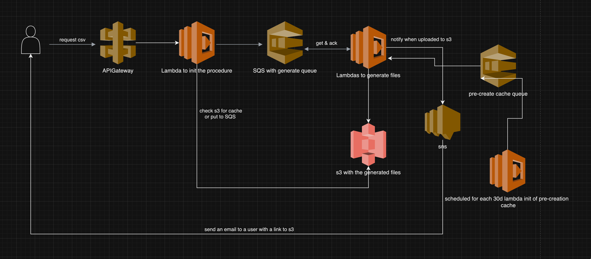

# Eversports FS Task
In this repository you will find a simplified NestJS server the exposes API endpoints to consumers. For this exercise, the API endpoints are not protected.

### Prerequisites

- [Node.JS](https://nodejs.org/en/download/)
- [NPM](https://www.npmjs.com/get-npm)
- [NVM](https://github.com/nvm-sh/nvm) (optional to manage node versions)
- [NestJS](https://docs.nestjs.com/) installed globally

```sh
npm install -g @nestjs/cli
```

### NVM Supported

Switch to the correct node version
```sh
nvm use
```

## Installation

```sh
npm install
```

### Usage

```sh
npm run start
```

### Run tests
```sh
npm run test
```


## Task 2

_The team discovered that users are interested in **exporting all of their memberships** from the system to run their own analysis once a month as a **CSV file**. Because the creation of the export file would take some seconds, the team decided to go for an **asynchronous process** for creating the file and sending it via email. The process will be triggered by an API call of the user._

_Your task is to **map out a diagram** that visualizes the asynchronous process from receiving the request to sending the export file to the user. This diagram should include all software / infrastructure components that will be needed to make the process as stable and scalable as possible._

_Because the team has other things to work on too, this task is timeboxed to **1 hour** and you should share the architecture diagram as a **PDF file**._

[Link to PDF](./task2.pdf)


